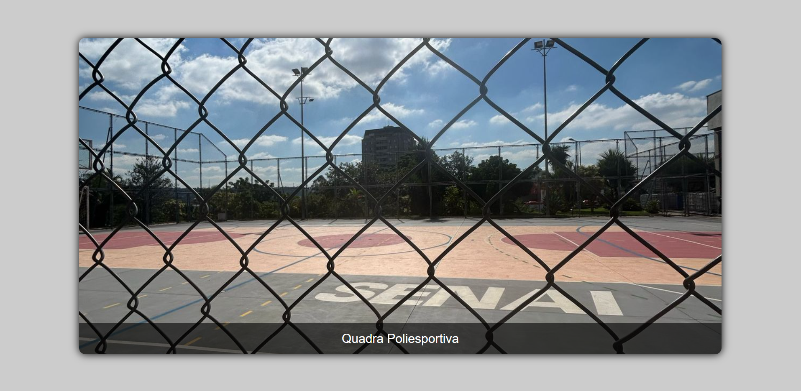

# Carrosel de Imagens - Tailwind CSS

## Descrição

Projeto desenvolvido no curso Técnico em Desenvolvimento de Sistemas do SENAI, consiste na criação de um site com três imagens em animação infinita, utilizando HTML e Tailwind CSS.

## Tecnologias

* HTML
* Tailwind CSS

## Autor

[Milla Regina](https://www.linkedin.com/in/milla-regina-468020206)
